## BUG-001: Username Case Sensitivity Not Enforced

Severity: High
Category: Validation / Security

Description:
The API allows creation of usernames that differ only by letter case (e.g., John_Doe vs john_doe). This can cause account duplication, authentication confusion, and potential security loopholes.

Steps to Reproduce:

1.Create a user with username john_doe.

2.Create another user with username John_Doe.

3.Observe the response.

Expected Result:
The API should reject the second request with an error such as "Username already exists", treating usernames as case-insensitive.

Actual Result:
The API accepts both requests, allowing two distinct users with john_doe and John_Doe.

Evidence:

// Request
```json
{
  "username": "John_Doe",
  "email": "new_user@example.com",
  "password": "oldnew",
  "age": 25,
  "phone": "+25452548521"
}
```
// Response
```json
{
  "id": 17,
  "username": "john_doe",
  "email": "new_user@example.com",
  "age": 25,
  "created_at": "2025-09-14T22:11:13.545343",
  "is_active": true,
  "phone": "+25452548521",
  "last_login": null
}
```
Screenshot
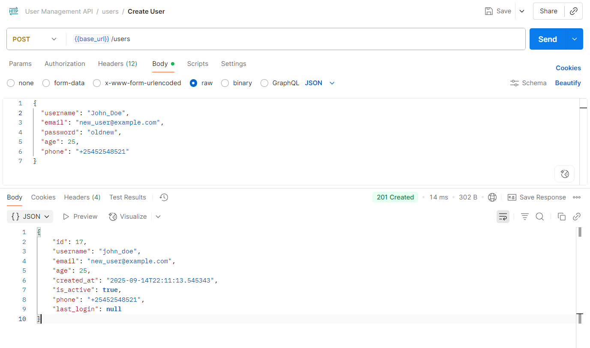

## BUG-002: Duplicate Email Allowed

Severity: High
Category: Validation / Data Integrity

Description:
The API allows creating multiple users with the same email address. This can lead to account hijacking vectors, password reset confusion, and broken uniqueness assumptions across the system.

Steps to Reproduce:
1.Create a user with email new_user@example.com.
2.Create another user with the same email new_user@example.com.
3.Observe that both requests are accepted.

Expected Result:
The second request should be rejected with an error such as Email already exists (unique email constraint).

Actual Result:
The second request is accepted and another user is created (201 Created).

Evidence:

// Request 
```json
{
  "username": "user_neww",
  "email": "new_user@example.com",
  "password": "oldneew",
  "age": 25,
  "phone": "+25452548521"
}

```
// Response
201 Created

```json

{
    "id": 20,
    "username": "user_neww",
    "email": "new_user@example.com",
    "age": 25,
    "created_at": "2025-09-15T09:44:17.533662",
    "is_active": true,
    "phone": "+25452548521",
    "last_login": null
}
```
Screenshot
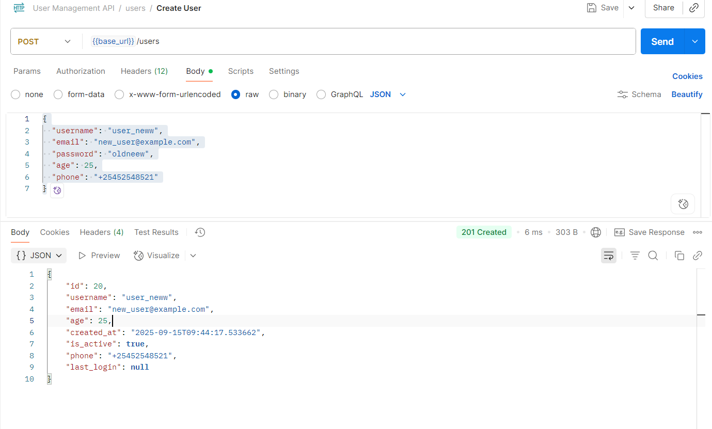

## BUG-003: Email Uniqueness Not Case-Insensitive

Severity: High
Category: Validation / Data Integrity

Description:
The API allows creating multiple users where the email differs only by letter case (e.g., new_user@example.com
 vs New_User@example.com
). This breaks uniqueness guarantees and can cause password reset mix-ups and security risks.

Steps to Reproduce:
1.Create a user with email new_user@example.com.
2.Create another user with email New_User@example.com(same email, different case).
3.Observe the response.

Expected Result:
The second request should be rejected with an error such as Email already exists, treating emails as case-insensitive.

Actual Result:
The API accepts both requests and creates two users (201 Created).

Evidence:

// Request 
```json

{
  "username": "usernewuser",
  "email": "New_User@example.com",
  "password": "oldnew",
  "age": 25,
  "phone": "+25452548521"
}

```
// Response

201 Created
```json

{
  "id": 19,
  "username": "usernewuser",
  "email": "New_User@example.com",
  "age": 25,
  "created_at": "2025-09-15T09:26:34.404698",
  "is_active": true,
  "phone": "+25452548521",
  "last_login": null
}
```
Screenshot
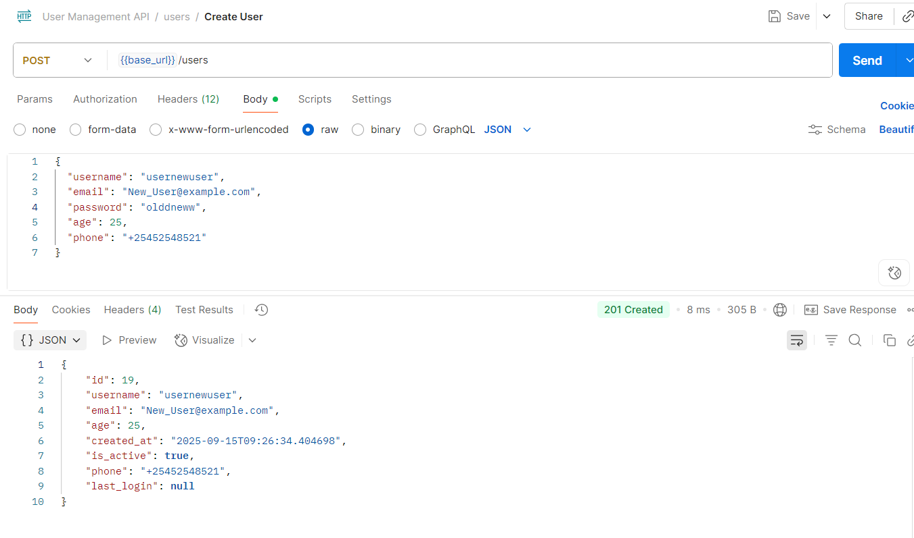

## BUG-004: Phone Validation Accepts “+00” Prefix 

Severity: High
Category: Validation / Data Integrity

Description:
The API allows creating a user whose phone number begins with “+00”. Per E.164, the first digit after “+” must be 1–9 (country codes cannot start with 0). Accepting “+00…” leads to invalid records and downstream SMS/telephony failures.

Steps to Reproduce:
1.Set method to POST, endpoint to /users.
2.Add header Content-Type: application/json.
3.Send a request where the phone starts with “+0” (e.g., “+0049265680”).
4.Observe the response.

Expected Result:
The request should be rejected with 422 Unprocessable Content and an error such as Invalid phone number format (E.164: first digit after “+” must be 1–9).

Actual Result:
The API accepts the request and creates the user (201 Created) with the invalid phone number.

Evidence:

// Request 
```json
{
  "username": "{{uniqUser}}",
  "email": "{{uniqEmail}}",
  "password": "{{pw6}}",
  "age": 25,
  "phone": "+0049265680"
}

```
// Response

201 Created
```json
{
  "id": 38,
  "username": "ph1757942908198",
  "email": "ph1757942908198@example.com",
  "age": 25,
  "created_at": "2025-09-15T16:28:28.235929",
  "is_active": true,
  "phone": "+0049265680",
  "last_login": null
}
```
Screenshot
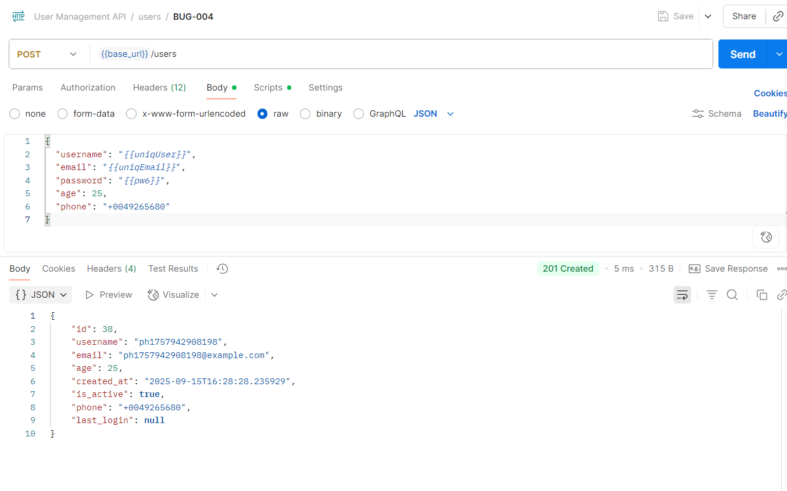

## BUG-005: Missing Ownership Check – Any User Can Update Other Users (IDOR/BOLA) via PUT /users/{id}

Severity: Critical
Category: Security / Authorization (IDOR/BOLA)

Description:
An authenticated user can update another user’s profile by supplying that user’s id in the path. The endpoint returns 200 OK and persists the change. This is an Insecure Direct Object Reference (IDOR/BOLA) issue that allows horizontal privilege escalation.

Steps to Reproduce:
1.Set method to PUT, endpoint to /users/{otherUserId} (e.g., /users/11).
2.Add header Content-Type: application/json.
3.Add header Authorization: Bearer {{token}} where the token belongs to a different user (e.g., user_id = 7).
4.Set body to update a field (e.g., phone) and send the request:

{ "phone": "+19175551236" }


5.Observe the response.

Expected Result:
The request should be rejected with 403 Forbidden (or 404 Not Found) and the target user’s data must not change.

Actual Result:
The API responds 200 OK and updates the other user’s record.

Evidence:

// Request 
(token belongs to user_id=7; path targets user_id=11)
```json 
{
  "phone": "+19175551236"
}
```
// Response
```json

{
  "id": 11,
  "username": "new_user",
  "email": "new_user@example.com",
  "age": 25,
  "created_at": "2025-09-14T15:44:47.880142",
  "is_active": true,
  "phone": "+19175551236",
  "last_login": null
}
```
Screenshot
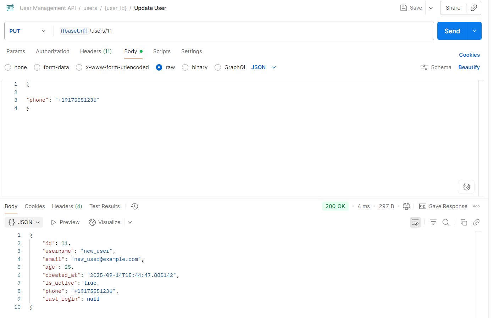

## BUG-006: PUT /users/{selfId} accepts non-digit string in phone 

Severity: High
Category: Validation / Data Integrity

Description:
Updating phone with a non-digit string (e.g., "string") is accepted. Per E.164, phone must be + plus up to 15 digits. Accepting arbitrary strings creates invalid records and downstream SMS failures.

Steps to Reproduce:
1.Login and obtain a Bearer token for your own account (e.g., user 7).
2.Send PUT /users/7 with the Authorization header set to Bearer {{token}}.
3.Use the JSON body below where phone is a plain string.
4.Observe the response.

Expected Result:
422 Unprocessable Content with a validation error like “Invalid phone number format”.

Actual Result:
200 OK and the user record is updated with "phone": "string".

Evidence:

// Request 


PUT /users/7
Authorization: Bearer {{token}}
Content-Type: application/json
```json
{
  "phone": "string"
}

```
// Response
```json

200 OK
{
  "id": 7,
  "username": "admin_user",
  "email": "missingbearer@example.com",
  "age": 46,
  "created_at": "2025-09-14T12:46:48.906068",
  "is_active": true,
  "phone": "string",
  "last_login": "2025-09-15T19:27:57.124805"
}
```
Screenshot
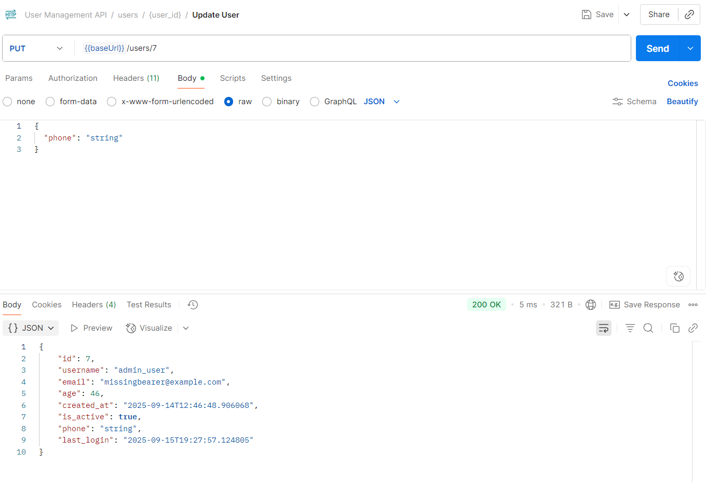

## BUG-007: PUT /users/{selfId} accepts 16-digit phone 

Severity: High
Category: Validation / Data Integrity

Description:
If the API accepts a phone with 16 digits after + (exceeding E.164 max of 15), it allows invalid numbers.

Steps to Reproduce:
1.Login and obtain a Bearer token for your own account (e.g., user 7).
2.Send PUT /users/7 with the Authorization header set to Bearer {{token}}.
3.Use the JSON body below where phone contains 16 digits after +.
4.Observe the response.

Expected Result:
422 Unprocessable Content with a validation error like “Invalid phone number format”.

Actual Result:
If you receive 200 OK, this is a BUG .

Evidence:
// Request 


PUT /users/7
Authorization: Bearer {{token}}
Content-Type: application/json

```json
{
  "phone": "+1917555123456789"
}
```
// Response
```json

{
  "id": 7,
  "username": "admin_user",
  "email": "…",
  "age": 46,
  "created_at": "…",
  "is_active": true,
  "phone": "+1917555123456789",
  "last_login": "…"
}
```
Screenshot
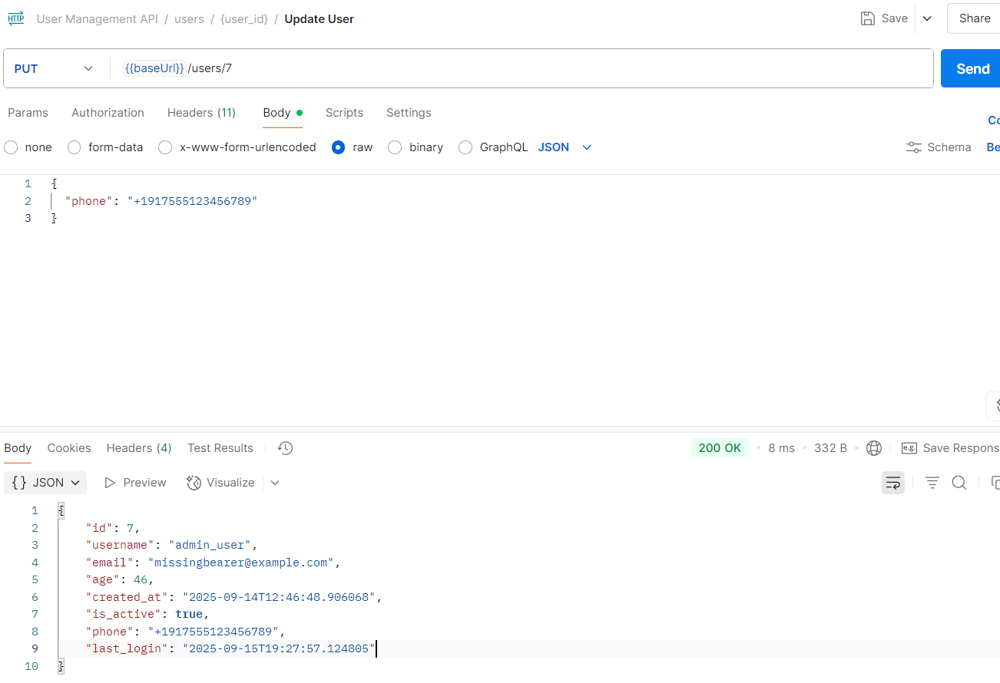

## BUG-008: Update accepts unexpected field username (should be rejected)

Severity: Medium–High
Category: Validation / Data Integrity (potential Mass Assignment risk)

Description:
PUT /users/{id} accepts payloads that include the extra/immutable field username. The request returns 200 OK and applies the valid fields while silently ignoring username. The API should reject unexpected or immutable fields with 422 Unprocessable Content so clients can detect schema violations.

Environment:
Base URL: {{base_url}} • Auth: Bearer {{token}} • User ID: 11 (existing user)

Steps to Reproduce:

1.Obtain a valid token and note an existing user id (e.g., 11).
2.Send PUT {{base_url}}/users/11 with headers Content-Type: application/json, Accept: application/json, and Authorization: Bearer {{token}}.
3.Body includes an extra field username plus a valid field (e.g., phone).

Expected Result:

422 Unprocessable Content.Validation error indicating username is not allowed (unexpected/immutable field).

Actual Result:

200 OK.Update succeeds; username is silently ignored, valid field is applied; no error returned.
Evidence:
// Request 
```json
{
  "username": "hacker_takeover",
  "phone": "+19175551234"
}
```
// Response
```json
{
  "id": 11,
  "username": "new_user",
  "email": "new_user@example.com",
  "age": 25,
  "created_at": "2025-09-14T15:44:47.880142",
  "is_active": true,
  "phone": "+19175551234",
  "last_login": null
}
```
Screenshot
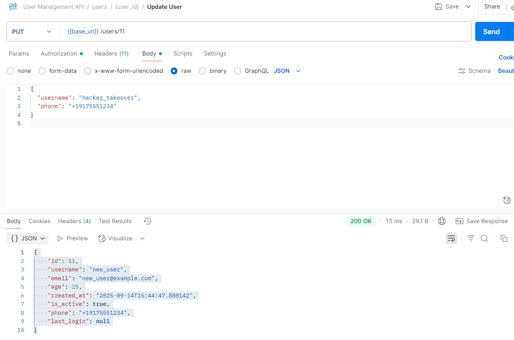

Impact/Risks:

Inconsistent schema enforcement; clients can ship invalid payloads undetected.
Increases risk of Mass Assignment if server-side model binding changes.
Data integrity and auditability concerns.

## BUG-009: DELETE /users/{id} allows non-admin to delete other users (Authorization Gap)

Severity: Critical
Category: Authorization / Access Control

Description:
A regular (non-admin) authenticated user can delete another user via Basic Auth. The endpoint lacks role/ownership checks, allowing unauthorized deactivation (soft delete).

Steps to Reproduce:
1.Set method to DELETE and URL to {{baseUrl}}/users/4
2.Authorization: Basic → Username={{attacker_username}}, Password={{attacker_password}}
3.Headers: Accept: application/json
4.Body: none
5.Send the request

Expected Result:
403 Forbidden with an authorization error; target account remains active.

Actual Result:
200 OK with:

{
  "message": "User deleted successfully",
  "was_active": true
}

// Request 

DELETE /users/4
Authorization: Basic ({{attacker_username}}:{{attacker_password}})
Accept: application/json

// Response
```json

{
  "message": "User deleted successfully",
  "was_active": true
}
```
Screenshot


Impact:
Any non-admin can deactivate arbitrary users (including privileged accounts), leading to account lockout/DoS.

## BUG-010: DELETE /users/{selfId} allows user to delete own account (Self-delete)

Severity: High
Category: Authorization / Policy

Description:
A regular user can soft-delete their own account via Basic Auth. There is no policy/role check to prevent self-deletion, leading to account lockout.

Steps to Reproduce:
1.Set method to DELETE and URL to {{baseUrl}}/users/{{selfId}} (e.g., /users/41)
2.Authorization: Basic → Username={{self_username}}, Password={{self_password}}
3.Headers: Accept: application/json
4.Body: none
5.Send the request

Expected Result:
403 Forbidden (or 405) and the account remains active (no state change).

Actual Result:
200 OK with

Evidence:
// Request

DELETE /users/41
Authorization: Basic ({{attacker_1758004274}}:{{attacker_password}})
Accept: application/json


// Response
```json
{
  "message": "User deleted successfully",
  "was_active": true
}
```
Screenshot


Impact:
Users can lock themselves out; risk of unintended service denial and support overhead.

## BUG-011: GET /session tokens without auth (Sensitive Data Exposure)

Severity: Critical
Category: Sensitive Data Exposure / Missing Authorization

Description:
The unauthenticated GET /stats?include_details=true endpoint returns sensitive data, including a full list of user emails and active session tokens. This is an information-disclosure vulnerability that enables account takeover (session hijacking), user enumeration, and privacy breaches.

Steps to Reproduce:

1.Set method to GET and URL to {{baseUrl}}/stats?include_details=true.
2.Authorization: No Auth.
3.Headers: Accept: application/json.
4.Send the request.

Expected Result:

401 Unauthorized or 403 Forbidden for unauthenticated callers;
or 200 OK with only aggregated, non-sensitive metrics (no emails or tokens).

Actual Result:

200 OK with user_emails array and session_tokens array returned to an unauthenticated client.

Evidence:

// Request

GET /stats?include_details=true
Accept: application/json
Authorization: (none)


// Response (truncated)
```json
{
  "total_users": 41,
  "active_users": 40,
  "inactive_users": 1,
  "active_sessions": 3,
  "api_version": "1.0.0",
  "user_emails": [
    "john@example.com",
    "jane@example.com",
    "victim_1758004274@example.com"
  ],
  "session_tokens": [
    "6945a24a755bdc110db72fba2302f51c",
    "037d6b5a9450f01deb559cf9a737ce5x",
    "f9d2f4a33be47c17d68a4bfc61166738"
  ]
}
```

Impact:

Immediate account takeover risk via exposed session tokens (Bearer tokens).

Privacy breach and phishing/targeting risk from bulk email exposure.

Enables user enumeration and reconnaissance against the system.

Screenshot
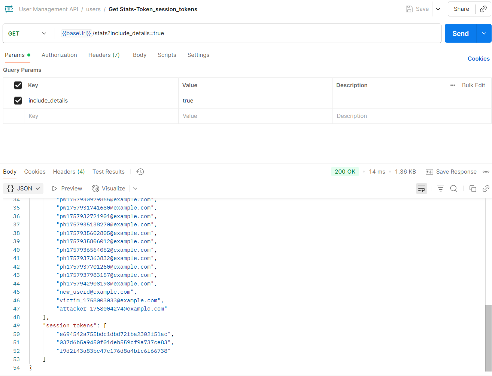

## BUG-012: POST /logout returns 200 for missing/invalid Bearer token (expected 401) — inconsistent auth

Severity: Medium
Category: Authentication / Session Management

Description
The /logout endpoint responds with 200 OK both when the Authorization header is absent and when it contains an invalid Bearer token. Other protected endpoints use verify_session() and correctly return 401 Unauthorized for invalid/missing tokens. This inconsistency weakens session handling and makes client/error handling and security monitoring unreliable.

Steps to Reproduce

1.Set method to POST, URL {{baseUrl}}/logout.
2.Case A – No Auth: Authorization → No Auth. Send.
3.Case B – Invalid Bearer: Authorization → Bearer Token, Token = deadbeef. Send.

Expected Result
*401 Unauthorized for missing or invalid Authorization: Bearer …, optionally with WWW-Authenticate: Bearer.
*Only when a valid session token is presented and revoked should the endpoint return 200 OK (or 204 No Content, if choosing idempotent logout semantics).

Actual Result

Case A (No Auth): 200 OK with body:
```json
{ "message": "No active session" }
```

Case B (Invalid Bearer): 200 OK with body:
```json
{ "message": "Logged out successfully" }
```
Evidence

Request (A):POST /logout
     Accept: application/json

Response (A): 200 OK
```json
{ "message": "No active session" }
```

Request (B):POST /logout
      Authorization: Bearer deadbeef
      Accept: application/json

Response (B): 200 OK
```json
{ "message": "Logged out successfully" }
```

Screenshots

Screenshot
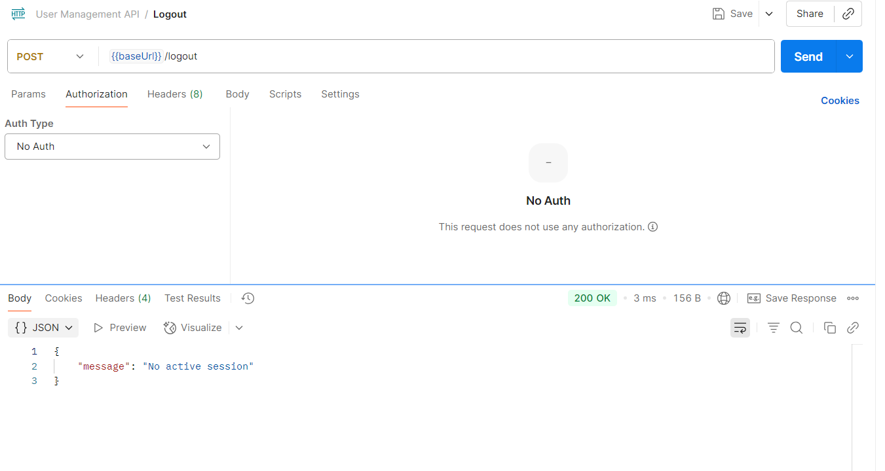
Screenshot
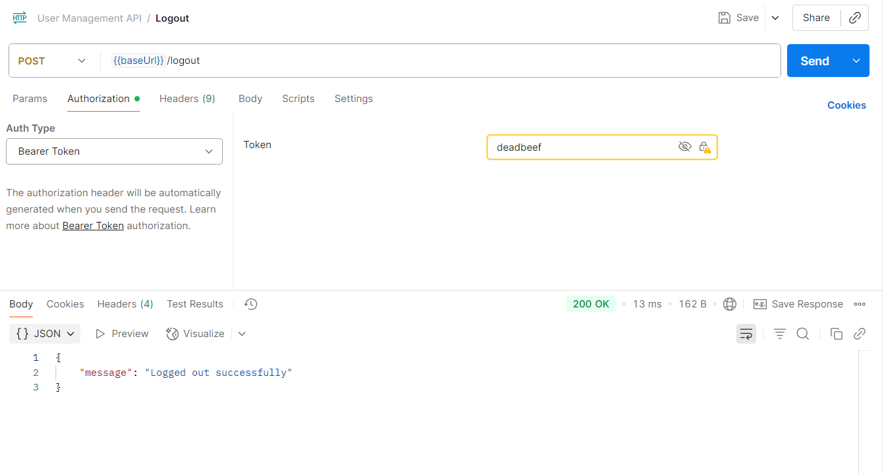

Impact

Unauthenticated requests appear “successful,” obscuring misuse in logs/metrics.
Clients cannot reliably detect expired/invalid sessions (no 401), complicating UX and error handling.
Inconsistent with the rest of the API’s authentication rules.


