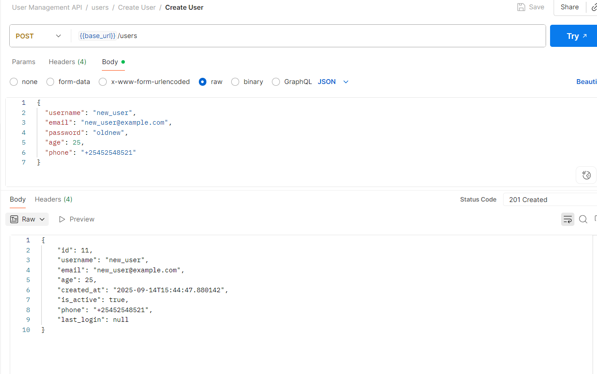

## Test #1 - GET /users (List Users)

- **Endpoint:** `GET /users?limit=10&offset=0&sort_by=id&order=asc`
- **Expected Result:** 200 OK + list of users
- **Actual Result:** 200 OK + users returned successfully
- **Result:** ✅ Pass

**Sample Response:**
```json
{
        "id": 1,
        "username": "john_doe",
        "email": "john@example.com",
        "age": 30,
        "created_at": "2025-09-14T12:46:36.572887",
        "is_active": true,
        "phone": "+15551234567",
        "last_login": null
    }
<<<<<<< HEAD
``` 
**Screenshot:**


=======
```

**Screenshot:**


## Test #2 - POST /users (Create User)

- **Endpoint:** `POST /users`
- **Expected Result:** 201 Created + new user returned successfully (without password in response)
- **Actual Result:** 201 Created + user created and returned successfully
- **Result:** ✅ Pass

**Sample Request Body:**
```json
{
  "username": "new_user",
  "email": "new_user@example.com",
  "password": "oldnew",
  "age": 25,
  "phone": "+25452548521"
}
```
```json
{
  "id": 11,
  "username": "new_user",
  "email": "new_user@example.com",
  "age": 25,
  "created_at": "2025-09-14T15:44:47.880142",
  "is_active": true,
  "phone": "+25452548521",
  "last_login": null
}
```
**Screenshot:**



>>>>>>> 0a1c54d (Add Test #2 (Create User) with screenshot)
