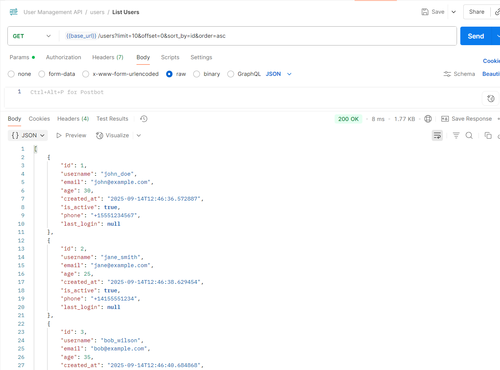

## Test #1 - GET /users (List Users)

- **Endpoint:** `GET /users?limit=10&offset=0&sort_by=id&order=asc`
- **Expected Result:** 200 OK + list of users
- **Actual Result:** 200 OK + users returned successfully
- **Result:** ✅ Pass

**Sample Response:**
```json
{
        "id": 1,
        "username": "john_doe",
        "email": "john@example.com",
        "age": 30,
        "created_at": "2025-09-14T12:46:36.572887",
        "is_active": true,
        "phone": "+15551234567",
        "last_login": null
    }
**Screenshot:**


