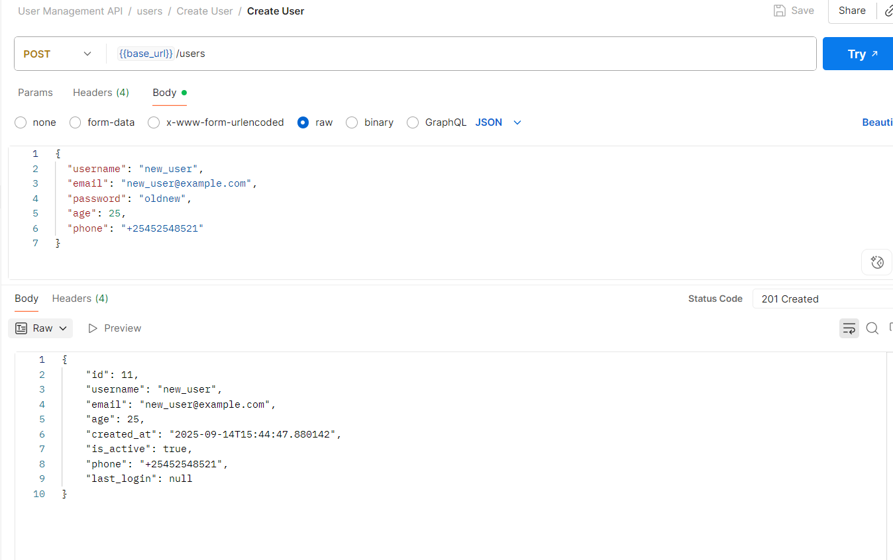
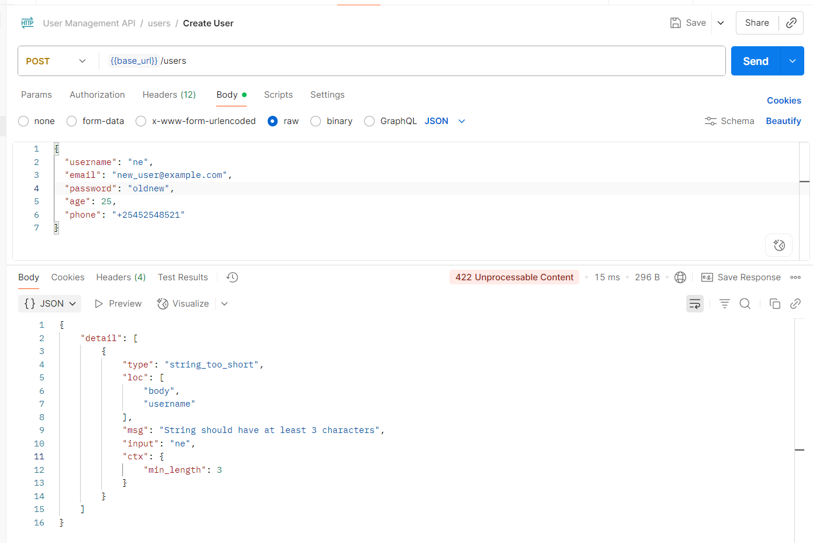
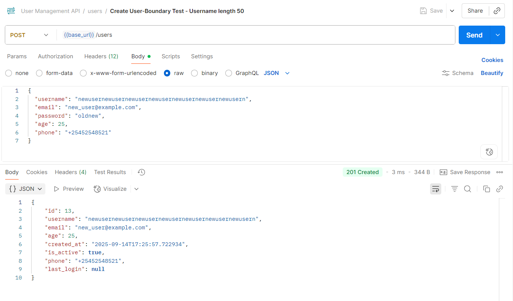
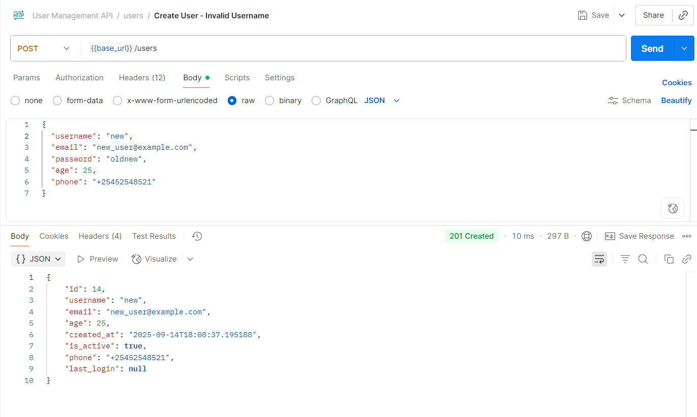

## Test #1 - GET /users (List Users)

**Endpoint:** `GET /users?limit=10&offset=0&sort_by=id&order=asc`  
**Expected Result:** 200 OK + list of users  
**Actual Result:** 200 OK + users returned successfully  
**Result:** ✅ Pass

**Sample Response (truncated):**
```json
[
  {
    "id": 1,
    "username": "john_doe",
    "email": "john@example.com",
    "age": 30,
    "created_at": "2025-09-14T12:46:36.572887",
    "is_active": true,
    "phone": "+15551234567",
    "last_login": null
  }
  // ...
]
```

Screenshot


## Test #2 - POST /users (Create User)

**Endpoint:** `POST /users`  
**Expected Result:** 201 Created + new user returned successfully (without password in response)  
**Actual Result:** 201 Created + user created and returned successfully  
**Result:** ✅ Pass

**Sample Request Body:**
```json
{
  "username": "new_user",
  "email": "new_user@example.com",
  "password": "oldnew",
  "age": 25,
  "phone": "+25452548521"
}
```
**Sample Response Body:**

```json
{
  "id": 11,
  "username": "new_user",
  "email": "new_user@example.com",
  "age": 25,
  "created_at": "2025-09-14T15:44:47.880142",
  "is_active": true,
  "phone": "+25452548521",
  "last_login": null
}
```

Screenshot


## Test #3 - POST /users (Validation Error - Username too short)

Endpoint: POST /users
Expected Result: 422 Unprocessable Content + validation error (username must be at least 3 characters)
Actual Result: 422 Unprocessable Content + validation error returned successfully
Result: ✅ Pass

**Sample Request Body:**
```json
{
  "username": "ne",
  "email": "new_user@example.com",
  "password": "oldnew",
  "age": 25,
  "phone": "+25452548521"
}
```
**Sample Response Body:**
```json
{
  "detail": [
    {
      "type": "string_too_short",
      "loc": [
        "body",
        "username"
      ],
      "msg": "String should have at least 3 characters",
      "input": "ne",
      "ctx": {
        "min_length": 3
      }
    }
  ]
}
```
Screenshot


## Test #4 - POST /users (Boundary Test - Username length 50)
Endpoint: POST /users
Expected Result: 201 Created + new user returned successfully (username accepted with 50 characters)
Actual Result: 201 Created + user created and returned successfully
Result: ✅ Pass

**Sample Request Body:**
```json
{
  "username": "newusernewusernewusernewusernewusernewusernewusern",
  "email": "new_user@example.com",
  "password": "oldnew",
  "age": 25,
  "phone": "+25452548521"
}
```
**Sample Response Body:**
```json
{
  "id": 13,
  "username": "newusernewusernewusernewusernewusernewusernewusern",
  "email": "new_user@example.com",
  "age": 25,
  "created_at": "2025-09-14T17:25:57.722934",
  "is_active": true,
  "phone": "+25452548521",
  "last_login": null
}
```
Screenshot


## Test #5 - POST /users (Boundary Test - Username length = 3)

Endpoint: POST /users
Expected Result: 201 Created + new user returned successfully (minimum 3-character username should be valid)
Actual Result: 201 Created + user created and returned successfully
Result: ✅ Pass

**Sample Request Body:**
```json
{
  "username": "new",
  "email": "new_user@example.com",
  "password": "oldnew",
  "age": 25,
  "phone": "+25452548521"
}
```
**Sample Response Body:**

```json
{
  "id": 14,
  "username": "new",
  "email": "new_user@example.com",
  "age": 25,
  "created_at": "2025-09-14T18:08:37.195188",
  "is_active": true,
  "phone": "+25452548521",
  "last_login": null
}

```
Screenshot
